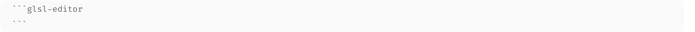
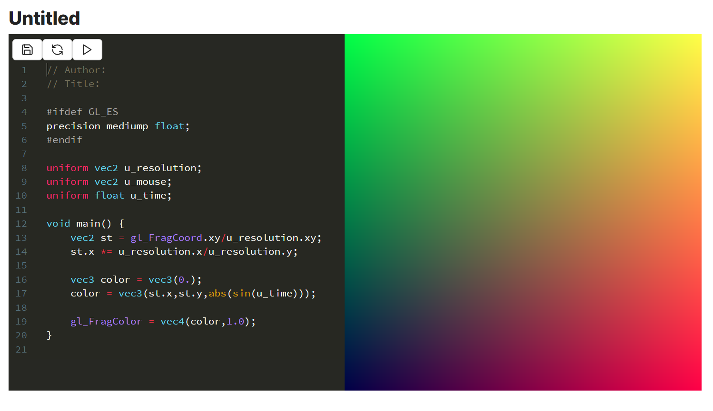

# Obsidian-GLSLEditor
> a glsl shader editor based on @patriciogonzalezvivo glslEditor now integrated into Obsidian notes

**Usage:**
Create an editor placing a `glsl-editor` block 

**Notes:**
- Shaders are not automatically saved, press save buton to keep your changes
- If you want to revert to last saved state, press the reload button
- Pressing play, the editor will display the cumulative result line by line
- Currently only the shown uniforms are available
- Currently vertex shader its not editable
- Currently only a quad mesh is available
- Currently textures are not available